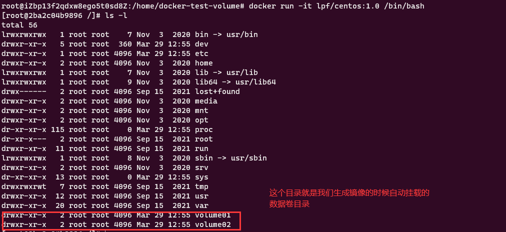
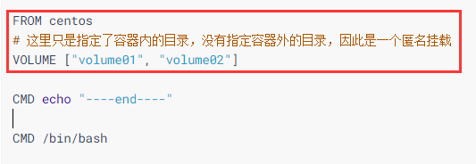
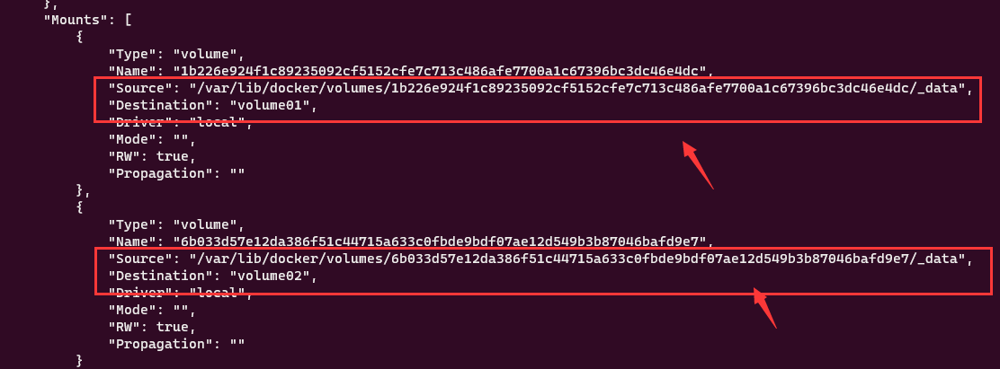
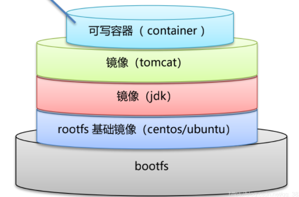
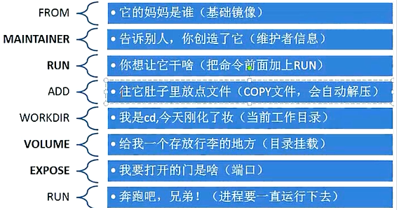
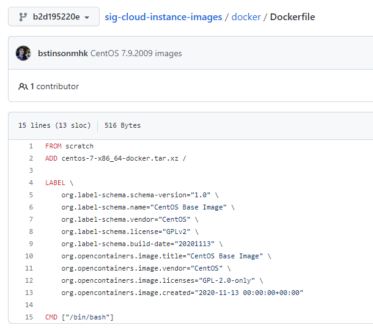

# Docker 简明学习手册

------

[TOC]

---

> docker 三要素：镜像（image）、容器（contain）、仓库（repository）
>
> **镜像：**相当于 java 中的类，一个 Java 类能生成多个实例，同样的一样镜像也能生成多个容器。
>
> **repository：**镜像存储位置（阿里云、DockerHub），类似github，分为公有仓库和私有仓库。
>
> **容器：**运行起来的镜像我们称之为容器，可以理解为运行环境或者实例。其实质是进程，随着代码运行结束，进程结束容器也就消失了。杀死或删除容器，镜像不受影响。

官网地址：[Home - Docker](https://www.docker.com/)

官方手册地址：[Docker Documentation](https://docs.docker.com/)(十分详细)

仓库地址：[Docker Hub Container Image Library | App Containerization](https://hub.docker.com/) 


# Docker 安装

> 以Ubuntu18.04为例，其中环境信息如下：

```shell
# 查看内核版本
root@iZbp13f2qdxw8ego5t0sd8Z:~# uname -r
4.15.0-169-generic

# 查看系统版本信息
root@iZbp13f2qdxw8ego5t0sd8Z:~# cat /etc/os-release
NAME="Ubuntu"
VERSION="18.04.6 LTS (Bionic Beaver)"
ID=ubuntu
ID_LIKE=debian
PRETTY_NAME="Ubuntu 18.04.6 LTS"
VERSION_ID="18.04"
HOME_URL="https://www.ubuntu.com/"
SUPPORT_URL="https://help.ubuntu.com/"
BUG_REPORT_URL="https://bugs.launchpad.net/ubuntu/"
PRIVACY_POLICY_URL="https://www.ubuntu.com/legal/terms-and-policies/privacy-policy"
VERSION_CODENAME=bionic
UBUNTU_CODENAME=bionic
```

> 安装 
>
> 官方帮助文档：[Install Docker Engine on Ubuntu | Docker Documentation](https://docs.docker.com/engine/install/ubuntu/)

```shell
# 1.Uninstall old versions 即使之前没有用过也应该清理一下
sudo apt-get remove docker docker-engine docker.io containerd runc

# 或者
# Uninstall the Docker Engine, CLI, and Containerd packages
sudo apt-get purge docker-ce docker-ce-cli containerd.io
# Images, containers, volumes, or customized configuration files on your host are not automatically removed. To delete all images, containers, and volumes:
sudo rm -rf /var/lib/docker		# 默认工作路径
sudo rm -rf /var/lib/containerd

# 2.使用脚本一键安装
curl -fsSL https://get.docker.com -o get-docker.sh
sudo sh get-docker.sh

# 或者
sudo curl -sS https://get.docker.com/ | sh
# 或者
sudo apt-get install docker.io

# 3.安装完毕，默认自动启动服务，测试是否成功
root@iZbp13f2qdxw8ego5t0sd8Z:~# docker run hello-world
Unable to find image 'hello-world:latest' locally
latest: Pulling from library/hello-world
2db29710123e: Pull complete
Digest: sha256:2498fce14358aa50ead0cc6c19990fc6ff866ce72aeb5546e1d59caac3d0d60f
Status: Downloaded newer image for hello-world:latest

Hello from Docker!
This message shows that your installation appears to be working correctly.

# 4. 你本地有gpu，继续执行如下命令以支持gpu调用（以ubutun为例）
# Add the package repositories 
distribution=$(. /etc/os-release;echo $ID$VERSION_ID) 
curl -s -L https://nvidia.github.io/nvidia-docker/gpgkey | sudo apt-key add - 
curl -s -L https://nvidia.github.io/nvidia-docker/$distribution/nvidia-docker.list | sudo tee /etc/apt/sources.list.d/nvidia-docker.list 

sudo apt-get update && sudo apt-get install -y nvidia-container-toolkit 
sudo systemctl restart docker

# 5.查看版本 `docker version`
root@iZbp13f2qdxw8ego5t0sd8Z:~# docker version
Client: Docker Engine - Community
 Version:           20.10.14
 API version:       1.41
 Go version:        go1.16.15
 Git commit:        a224086
 Built:             Thu Mar 24 01:47:57 2022
 OS/Arch:           linux/amd64
 Context:           default
 Experimental:      true

Server: Docker Engine - Community
 Engine:
  Version:          20.10.14
  API version:      1.41 (minimum version 1.12)
  Go version:       go1.16.15
  Git commit:       87a90dc
  Built:            Thu Mar 24 01:45:46 2022
  OS/Arch:          linux/amd64
  Experimental:     false
 containerd:
  Version:          1.5.11
  GitCommit:        3df54a852345ae127d1fa3092b95168e4a88e2f8
 runc:
  Version:          1.0.3
  GitCommit:        v1.0.3-0-gf46b6ba
 docker-init:
  Version:          0.19.0
  GitCommit:        de40ad0
```

# 阿里云镜像加速

1、登录阿里云，搜索`容器镜像服务`。网站：[容器镜像服务_镜像构建_镜像授权_镜像托管-阿里云 (aliyun.com)](https://www.aliyun.com/product/acr?spm=5176.21213303.1362911.1.639b53c92Sr2SM&scm=20140722.S_card@@卡片@@652._.ID_card@@卡片@@652-RL_容器镜像服务-OR_ser-V_2-P0_0)

2、管理控制台--镜像工具--镜像加速器

```shell
# 针对Docker客户端版本大于 1.10.0 的用户
# 您可以通过修改daemon配置文件/etc/docker/daemon.json来使用加速器

sudo mkdir -p /etc/docker

sudo tee /etc/docker/daemon.json <<-'EOF'
{
  "registry-mirrors": ["https://e9twu3sl.mirror.aliyuncs.com"]
}
EOF

sudo systemctl daemon-reload

sudo systemctl restart docker
```

3、登录阿里云

```shell
# 登录阿里云
export DOCKER_REGISTRY= your_registry_url<docker registry url>
(注意这里your_registry_url 最后字段结尾，不能多不能少E.g
registry.cn-shanghai.aliyuncs.com/xxxx/xxxx)
docker login $DOCKER_REGISTRY \
--username your_username \
--password your_password
```


# Docker 的常用命令

## 帮助命令

```shell
docker version		# 显示docker的版本信息
docker info			# 显示docker的详细系统信息，包括镜像和容器数量
docker --help		# 万能命令
```

帮助文档地址：[Docker run reference | Docker Documentation](https://docs.docker.com/engine/reference/run/)

## 镜像命令

**`docker images` 查看所有本地的主机上的镜像**

```shell
root@iZbp13f2qdxw8ego5t0sd8Z:~# docker images
REPOSITORY    TAG       IMAGE ID       CREATED        SIZE
hello-world   latest    feb5d9fea6a5   6 months ago   13.3kB

# 解释
REPOSITORY	镜像的仓库源
TAG			镜像的标签
IMAGE ID	镜像的ID
CREATED		镜像的创建时间
SIZE		镜像的大小

# 可选项
Options:
  -a, --all             Show all images (default hides intermediate images)
  -q, --quiet           Only show image IDs
# 常用
$ docker images -aq
```

> *dokcer search 某个镜像的名字*
>
> 从 Docker Hub 网站来搜索镜像，Docker Hub 网址为： https://hub.docker.com/


**`docker search` 搜索镜像**

```shell
root@iZbp13f2qdxw8ego5t0sd8Z:~# docker search mysql
NAME                             DESCRIPTION                                     STARS     OFFICIAL   AUTOMATED
mysql                            MySQL is a widely used, open-source relation…   12327     [OK]
mariadb                          MariaDB Server is a high performing open sou…   4740      [OK]
mysql/mysql-server               Optimized MySQL Server Docker images. Create…   915                  [OK]
percona                          Percona Server is a fork of the MySQL relati…   572       [OK]
phpmyadmin                       phpMyAdmin - A web interface for MySQL and M…   488       [OK]

# 可选项，通过收藏来过滤
root@iZbp13f2qdxw8ego5t0sd8Z:~# docker search mysql --filter=STARS=3000
NAME      DESCRIPTION                                     STARS     OFFICIAL   AUTOMATED
mysql     MySQL is a widely used, open-source relation…   12320     [OK]
mariadb   MariaDB Server is a high performing open sou…   4737      [OK]
```

> - NAME:镜像仓库源的名称
>
> - DESCRIPTION:镜像的描述
>
> - OFFICIAL:是否 docker 官方发布
>
>   
>
>   **参数说明**
>
>   - -s 点赞数大于 如：docker search -s 30 tomcat
>   - –no-trunc 说明不要被省略
>   - –automated 只罗列出 automated build 类型的镜像


**`docker pull` 拉取镜像**

```shell
# 下载镜像 docker pull 镜像名[:tag]
root@iZbp13f2qdxw8ego5t0sd8Z:~# docker pull mysql	
Using default tag: latest		# 如果不写tag，默认就是latest
latest: Pulling from library/mysql
72a69066d2fe: Pull complete		# 分层下载,联合文件下载
93619dbc5b36: Pull complete
99da31dd6142: Pull complete
626033c43d70: Pull complete
37d5d7efb64e: Pull complete
ac563158d721: Pull complete
d2ba16033dad: Pull complete
688ba7d5c01a: Pull complete
00e060b6d11d: Pull complete
1c04857f594f: Pull complete
4d7cfa90e6ea: Pull complete
e0431212d27d: Pull complete
Digest: sha256:e9027fe4d91c0153429607251656806cc784e914937271037f7738bd5b8e7709		# 签名
Status: Downloaded newer image for mysql:latest		
docker.io/library/mysql:latest		# 真实地址

# 两个等价
docker pull mysql
docker pull mysql:latest
```

> Usage:  docker pull [OPTIONS] NAME[:TAG|@DIGEST]
>
> docker pull mysql:5.7   # 指定下载5.7版本的mysql
>
> 下载完成后，我们就可以使用这个镜像了。


**`docker rmi` 删除镜像**

```shell
root@iZbp13f2qdxw8ego5t0sd8Z:~# docker rmi -f 容器id		# 删除指定容器
root@iZbp13f2qdxw8ego5t0sd8Z:~# docker rmi -f 容器id	容器id	容器id	# 删除指定容器
root@iZbp13f2qdxw8ego5t0sd8Z:~# docker rmi -f $(docker images -aq)		# 删除所有容器
```

> **注意**
>
> 正在运行的容器不能删除，需要`强制删除`，命令如下: `docker rmi -f hello-world`
>
> 删除多个镜像 docker rmi -f 镜像名 1:TAG 镜像名 2:TAG
> 删除全部镜像 docker rmi -f ${docker images -qa}

**删除悬空命令**

```shell
# 我们在build镜像的过程中，可能会产生一些临时的不具有名称也没有作用的镜像他们的名称一般都是,我们可以执行下面的命令将其清除掉：
docker rmi $(docker images -f "dangling=true" -q)
docker image prune -a -f
docker images|grep none|awk '{print $3}'|xargs docker rmi
```

## 容器命令

> docker 利用容器独立运行一个或一组应用。容器是镜像创建的运行实例。
>
> 他可以被启动、开始、停止、删除。每个容器都是相互隔离，保证安全的平台。
>
> 容器的定义和镜像几乎是一模一样，唯一的区别在于容器的最上一层是可读可写的。
>
> 下载了镜像后才可以创建容器，利用centos镜像进行测试学习

```shell
docker pull centos
```

**新建容器并启动**

```shell
$ docker run [OPTIONS] IMAGE

# 常用参数说明
-d, --detach		# Run container in background and print container ID
-i, --interactive	# Keep STDIN open even if not attached
--name="Name"		# Assign a name to the container,给容器命名，区分容器
-p					# Publish a container's port(s) to the host 指定容器端口 -小p
	-p ip:主机端口：容器端口
	-p 主机端口：容器端口  （常用）
	-p 容器端口
	容器端口
-P					# Publish all exposed ports to random ports 随机指定端口  小P
-it 				# 使用交互方式运行，进入容器查看内容
-t					# Allocate a pseudo-TTY


# Example
# 启动并进入容器

root@iZbp13f2qdxw8ego5t0sd8Z:~# docker images
REPOSITORY    TAG       IMAGE ID       CREATED        SIZE
mysql         5.7       c20987f18b13   3 months ago   448MB
mysql         latest    3218b38490ce   3 months ago   516MB
hello-world   latest    feb5d9fea6a5   6 months ago   13.3kB
centos        latest    5d0da3dc9764   6 months ago   231MB
root@iZbp13f2qdxw8ego5t0sd8Z:~# docker run -it centos /bin/bash
[root@c4d9aeffe070 /]# ls		# 查看容器内的centos
bin  dev  etc  home  lib  lib64  lost+found  media  mnt  opt  proc  root  run  sbin  srv  sys  tmp  usr  var

# 从容器中退出
[root@c4d9aeffe070 /]# exit
exit
root@iZbp13f2qdxw8ego5t0sd8Z:~# ls
get-docker.sh
```

**列出所有的容器**

```shell
docker ps [OPTIONS]
# docker ps 命令
	# 不加参数时，列出当前正在运行的容器
-a	# 列出当前正在运行的容器+带出历史运行过的容器
-n=?	# 显示最近创建的前n个容器
-q		# 只显示容器编号

root@iZbp13f2qdxw8ego5t0sd8Z:~# docker ps -aq
c4d9aeffe070
14d2bb5d8866
root@iZbp13f2qdxw8ego5t0sd8Z:~# docker ps -a
CONTAINER ID   IMAGE         COMMAND       CREATED         STATUS                     PORTS     NAMES
c4d9aeffe070   centos        "/bin/bash"   3 minutes ago   Exited (0) 2 minutes ago             great_herschel
14d2bb5d8866   hello-world   "/hello"      2 hours ago     Exited (0) 2 hours ago               magical_mahavira
```

**退出容器**

```shell
exit 	# 容器停止退出
ctrl+p q	# 容器不停止退出

# Example
root@iZbp13f2qdxw8ego5t0sd8Z:~# docker run -it centos /bin/bash
[root@3b44afe1d1aa /]# 
# ctrl+p q
root@iZbp13f2qdxw8ego5t0sd8Z:~# docker ps
CONTAINER ID   IMAGE     COMMAND       CREATED          STATUS          PORTS     NAMES
3b44afe1d1aa   centos    "/bin/bash"   14 seconds ago   Up 14 seconds             condescending_wescoff
```

**删除容器**

```shell
docker rm 容器id					   # 删除指定容器，不能删除正在运行的容器，强制删除 rm -f
docker rm -f $(docker ps -aq)		# 删除所有容器
docker ps -a -q|xargs docker rm 	# 删除所有容器
```

**启动和停止容器的操作**

```shell
docker start 容器id		# 启动容器
docker restart 容器id		# 重启容器
docker stop 容器id		# 停止当前正在运行的容器
docker kill 容器id		# 强制停止当前容器
```

## 常用其它命令

**后台启动容器**==**守护式容器**==

```shell
# 使用镜像 centos:latest 以后台模式启动一个容器
# 命令 docker run -d 镜像名
docker run -d centos

# 问题：以 docker ps -a 命令查看，会发现容器已经退出
```

> 这是因为 **Dcoker 容器后台运行，就必须有一个前台进程**
>
> **容器运行的命令如果不是那些一直挂起的命令，（比如运行 top ，tail）就会自动退出**
>
> 这是 docker 的机制问题，比如你的 web 容器，如 nginx，在正常情况下，我们配置启动服务只需要启动相应的 service 即可，如`service start nginx`
>
> 但是这样做会导致 nginx 以后台进程模式运行，从而导致 docker 前台没有运行的应用，因此容器后台启动后，会觉得自己没事可做了而自杀，所以最佳的解决方案是，将要运行的程序以前台进程的形式启动。如：`docker run -d centos /bin/sh -c "while true;do echo hello world;sleep 2;done"`

```shell
# 给后台进程添加一个前台的程序代码
root@iZbp13f2qdxw8ego5t0sd8Z:~# docker run -d centos /bin/sh -c "while true;do echo hello world;sleep 2;done"
dc11a9279a01ea26957140570ef9a5db817db38d043c71fdd0d88ad0d4810618

# docker ps 查看后台有容器运行
root@iZbp13f2qdxw8ego5t0sd8Z:~# docker ps
CONTAINER ID   IMAGE     COMMAND                  CREATED         STATUS         PORTS     NAMES
dc11a9279a01   centos    "/bin/sh -c 'while t…"   8 seconds ago   Up 7 seconds             quizzical_leakey
```


**查看容器日志**

```shell
docker logs -f -t --tail 容器 Id

# 参数说明
	-t : 加入时间
    -f : 跟随最新的日志打印
    –-tail或者-n :数字显示多少条
    
# 自己编写一段shell脚本    
"while true;do echo hello world;sleep 2;done"

# 显示指定行数的日志
root@iZbp13f2qdxw8ego5t0sd8Z:~# docker logs -f -t -n 10 dc11a9279a01
2022-03-30T11:59:12.054789567Z hello world
2022-03-30T11:59:14.056960350Z hello world
2022-03-30T11:59:16.058862681Z hello world
2022-03-30T11:59:18.060677654Z hello world
2022-03-30T11:59:20.062403562Z hello world
2022-03-30T11:59:22.064298338Z hello world
2022-03-30T11:59:24.066316490Z hello world
2022-03-30T11:59:26.068089399Z hello world
2022-03-30T11:59:28.069977458Z hello world
2022-03-30T11:59:30.071978774Z hello world
2022-03-30T11:59:32.073835759Z hello world
2022-03-30T11:59:34.075741871Z hello world
2022-03-30T11:59:36.077601766Z hello world
```

**查看容器中进程信息**

```shell
# 命令 docker top 容器 Id
root@iZbp13f2qdxw8ego5t0sd8Z:~# docker top dc11a9279a01
UID                 PID                 PPID                C                   STIME           
root                26688               26656               0                   20:05           
root                26817               26688               0                   20:06           

# 查看容器内部细节 docker inspect 容器 Id
root@iZbp13f2qdxw8ego5t0sd8Z:~# docker inspect dc11a9279a01
[
    {
        "Id": "dc11a9279a01ea26957140570ef9a5db817db38d043c71fdd0d88ad0d4810618",
        "Created": "2022-03-30T11:55:21.46618149Z",
        "Path": "/bin/sh",
        "Args": [
            "-c",
            "while true;do echo hello world;sleep 2;done"
        ],
        "State": {
            "Status": "running",
            "Running": true,
            "Paused": false,
            "Restarting": false,
            "OOMKilled": false,
            "Dead": false,
            "Pid": 26688,
            "ExitCode": 0,
            "Error": "",
            "StartedAt": "2022-03-30T12:05:28.250657922Z",
            "FinishedAt": "2022-03-30T12:03:36.792175497Z"
        },
        "Image": "sha256:5d0da3dc976460b72c77d94c8a1ad043720b0416bfc16c52c45d4847e53fadb6",
        "ResolvConfPath": "/var/lib/docker/containers/dc11a9279a01ea26957140570ef9a5db817db38d043c71fdd0d88ad0d4810618/resolv.conf",
        "HostnamePath": "/var/lib/docker/containers/dc11a9279a01ea26957140570ef9a5db817db38d043c71fdd0d88ad0d4810618/hostname",
        "HostsPath": "/var/lib/docker/containers/dc11a9279a01ea26957140570ef9a5db817db38d043c71fdd0d88ad0d4810618/hosts",
        "LogPath": "/var/lib/docker/containers/dc11a9279a01ea26957140570ef9a5db817db38d043c71fdd0d88ad0d4810618/dc11a9279a01ea26957140570ef9a5db817db38d043c71fdd0d88ad0d4810618-json.log",
        "Name": "/quizzical_leakey",
        "RestartCount": 0,
        "Driver": "overlay2",
        "Platform": "linux",
        "MountLabel": "",
        "ProcessLabel": "",
        "AppArmorProfile": "docker-default",
        "ExecIDs": null,
        "HostConfig": {
            "Binds": null,
            "ContainerIDFile": "",
            "LogConfig": {
                "Type": "json-file",
                "Config": {}
            },
            "NetworkMode": "default",
            "PortBindings": {},
            "RestartPolicy": {
                "Name": "no",
                "MaximumRetryCount": 0
            },
            "AutoRemove": false,
            "VolumeDriver": "",
            "VolumesFrom": null,
            "CapAdd": null,
            "CapDrop": null,
            "CgroupnsMode": "host",
            "Dns": [],
            "DnsOptions": [],
            "DnsSearch": [],
            "ExtraHosts": null,
            "GroupAdd": null,
            "IpcMode": "private",
            "Cgroup": "",
            "Links": null,
            "OomScoreAdj": 0,
            "PidMode": "",
            "Privileged": false,
            "PublishAllPorts": false,
            "ReadonlyRootfs": false,
            "SecurityOpt": null,
            "UTSMode": "",
            "UsernsMode": "",
            "ShmSize": 67108864,
            "Runtime": "runc",
            "ConsoleSize": [
                0,
                0
            ],
            "Isolation": "",
            "CpuShares": 0,
            "Memory": 0,
            "NanoCpus": 0,
            "CgroupParent": "",
            "BlkioWeight": 0,
            "BlkioWeightDevice": [],
            "BlkioDeviceReadBps": null,
            "BlkioDeviceWriteBps": null,
            "BlkioDeviceReadIOps": null,
            "BlkioDeviceWriteIOps": null,
            "CpuPeriod": 0,
            "CpuQuota": 0,
            "CpuRealtimePeriod": 0,
            "CpuRealtimeRuntime": 0,
            "CpusetCpus": "",
            "CpusetMems": "",
            "Devices": [],
            "DeviceCgroupRules": null,
            "DeviceRequests": null,
            "KernelMemory": 0,
            "KernelMemoryTCP": 0,
            "MemoryReservation": 0,
            "MemorySwap": 0,
            "MemorySwappiness": null,
            "OomKillDisable": false,
            "PidsLimit": null,
            "Ulimits": null,
            "CpuCount": 0,
            "CpuPercent": 0,
            "IOMaximumIOps": 0,
            "IOMaximumBandwidth": 0,
            "MaskedPaths": [
                "/proc/asound",
                "/proc/acpi",
                "/proc/kcore",
                "/proc/keys",
                "/proc/latency_stats",
                "/proc/timer_list",
                "/proc/timer_stats",
                "/proc/sched_debug",
                "/proc/scsi",
                "/sys/firmware"
            ],
            "ReadonlyPaths": [
                "/proc/bus",
                "/proc/fs",
                "/proc/irq",
                "/proc/sys",
                "/proc/sysrq-trigger"
            ]
        },
        "GraphDriver": {
            "Data": {
                "LowerDir": "/var/lib/docker/overlay2/01a933aa5a46d83128f0b8f37f55fe112077092557b4ddb736295874792e8b13-init/diff:/var/lib/docker/overlay2/26a804afdd9bc86a315da8c2d09fe07452ddbcc9e6e00428ea37a85219929570/diff",
                "MergedDir": "/var/lib/docker/overlay2/01a933aa5a46d83128f0b8f37f55fe112077092557b4ddb736295874792e8b13/merged",
                "UpperDir": "/var/lib/docker/overlay2/01a933aa5a46d83128f0b8f37f55fe112077092557b4ddb736295874792e8b13/diff",
                "WorkDir": "/var/lib/docker/overlay2/01a933aa5a46d83128f0b8f37f55fe112077092557b4ddb736295874792e8b13/work"
            },
            "Name": "overlay2"
        },
        "Mounts": [],
        "Config": {
            "Hostname": "dc11a9279a01",
            "Domainname": "",
            "User": "",
            "AttachStdin": false,
            "AttachStdout": false,
            "AttachStderr": false,
            "Tty": false,
            "OpenStdin": false,
            "StdinOnce": false,
            "Env": [
                "PATH=/usr/local/sbin:/usr/local/bin:/usr/sbin:/usr/bin:/sbin:/bin"
            ],
            "Cmd": [
                "/bin/sh",
                "-c",
                "while true;do echo hello world;sleep 2;done"
            ],
            "Image": "centos",
            "Volumes": null,
            "WorkingDir": "",
            "Entrypoint": null,
            "OnBuild": null,
            "Labels": {
                "org.label-schema.build-date": "20210915",
                "org.label-schema.license": "GPLv2",
                "org.label-schema.name": "CentOS Base Image",
                "org.label-schema.schema-version": "1.0",
                "org.label-schema.vendor": "CentOS"
            }
        },
        "NetworkSettings": {
            "Bridge": "",
            "SandboxID": "461b71a9214f3869d1ebe03afdea826db9e55981f001eda516f1f1ace434ad28",
            "HairpinMode": false,
            "LinkLocalIPv6Address": "",
            "LinkLocalIPv6PrefixLen": 0,
            "Ports": {},
            "SandboxKey": "/var/run/docker/netns/461b71a9214f",
            "SecondaryIPAddresses": null,
            "SecondaryIPv6Addresses": null,
            "EndpointID": "fc8ae6f0269fc290ef96d4f5761abf5628aab2865fa8afe4f0f6d67f774e54e7",
            "Gateway": "172.18.0.1",
            "GlobalIPv6Address": "",
            "GlobalIPv6PrefixLen": 0,
            "IPAddress": "172.18.0.2",
            "IPPrefixLen": 16,
            "IPv6Gateway": "",
            "MacAddress": "02:42:ac:12:00:02",
            "Networks": {
                "bridge": {
                    "IPAMConfig": null,
                    "Links": null,
                    "Aliases": null,
                    "NetworkID": "dc14bcb35047096737b52c679b0e2752d327d7109b3026c26ff28c7e9d89ba55",
                    "EndpointID": "fc8ae6f0269fc290ef96d4f5761abf5628aab2865fa8afe4f0f6d67f774e54e7",
                    "Gateway": "172.18.0.1",
                    "IPAddress": "172.18.0.2",
                    "IPPrefixLen": 16,
                    "IPv6Gateway": "",
                    "GlobalIPv6Address": "",
                    "GlobalIPv6PrefixLen": 0,
                    "MacAddress": "02:42:ac:12:00:02",
                    "DriverOpts": null
                }
            }
        }
    }
]
```

**进入当前正在运行的容器并以命令行交互**

```shell
# 通常容器都是在后台运行的，需要进入容器，修改一些配置

# 方式1 直接进入容器启动命令的终端，不会启动新的进程 
`docker exec -it 容器 Id bashShell`

root@iZbp13f2qdxw8ego5t0sd8Z:~# docker exec -it dc11a9279a01 /bin/bash
[root@dc11a9279a01 /]# ls
bin  dev  etc  home  lib  lib64  lost+found  media  mnt  opt  proc  root  run  sbin  srv  sys  tmp  usr  var
[root@dc11a9279a01 /]# ps -ef
UID        PID  PPID  C STIME TTY          TIME CMD
root         1     0  0 12:05 ?        00:00:00 /bin/sh -c while true;do echo hello world;sleep 2;done
root       276     0  0 12:14 pts/0    00:00:00 /bin/bash
root       312     1  0 12:15 ?        00:00:00 /usr/bin/coreutils --coreutils-prog-shebang=sleep /usr/bin/sleep 2
root       313   276  0 12:15 pts/0    00:00:00 ps -ef

# 方式2 在容器中打开新的终端，并且可以启动新的进程
# 重新进入 docker attach 容器 Id
root@iZbp13f2qdxw8ego5t0sd8Z:~# docker attach dc11a9279a01
执行之前的终端代码...

# docker exec		# 进入容器后开启一个新的终端，可以在里面操作（常用）
# docker attach		# 进入容器正在执行的终端

```

**从容器内拷贝文件到主机上**

```shell
# docker cp 容器 Id:容器内的路径 目的路径

root@iZbp13f2qdxw8ego5t0sd8Z:/home# docker cp 8f5f2ebf7143:/home/test.txt /home
root@iZbp13f2qdxw8ego5t0sd8Z:/home# ls
dockerfile  docker-test-volume  test.txt

# 拷贝是一个手动的过程，通过卷挂载 -v 的技术，可以实现自动同步
```

> 从主机拷贝到容器内，一般使用卷挂载

## 小结


```shell
attach		Attach to a running container			#当前shell 下attach连接指定运行镜像
build		Build an image from a Dockerfile		#通过Dockerfile定制镜像
commit		create a new image from a container changes #提交当前容器为新的镜像
cp			copy files/folders from the containers filesystem to the host path	#从容器中拷贝指定文件或者目录到宿主机中
create		Create a , new dontainer	#创建一个新的容器,同run，但不启动容器
diff		Inspect changes on a container's filesystem	#查看docker容器变化
events		Get real time events from thei server	#从 docker服务获取容器实时事件
exec		Run a command in an existing container	#在已存在的容器上运行命令
export 		Stream the contents of a container as a tar archive #导出容器的内容流作为一个tar 归档文件[对应import ]
history 	Show the history of an image		#展示一个镜像形成历史
images		List images		#列出系统当前镜像
import 		Create a new filesystem image from the contents of a tarbal1	# 从tar包中的内容创建一个新的文件系统映像[对应export]
info		Display system-wide information	#显示系统相关信息
inspect 	Return low-level information on a container	#查看容器详细信息
kill		Kill a running container	# ki11指定docker容器
load 		Load an image from a tar archive	#从一个tar包中加载一个镜像[对应save]
login 		Register or Login to the docker registry server #注册或者登陆一个docker源服务器	
logout 		Log out from a Docker registry server	#从当前Docker registry 退出
logs		Fetch the logs of a container	#输出当前容器日志信息
port		Lookup the public-facing port which is NAT-ed to PRIVATE_PORT #查看映射端口对应的容器内部源端口
pause		Pause al7 processes within a container		#暂停容器
ps			List containers		#列出容器列表
pu11		Pu]l an image or a repository from the docker registry server # 从docker镜像源服务器拉取指定镜像或者库镜像
push		Push an image or a repository to the docker registry server #推送指定镜像或者库镜像至docker源服务器
restart		Restart a running container		#重启运行的容器
rm			Remove one or more .containers	#移除一个或者多个容器
rmi			Remove one or more images		#移除一个或多个镜像[无容器使用该镜像才可删除，否则需删除相关容器才可继续或-f强制删除]
run			Run a command in a . new container	#创建一个新的容器并运行一个命令
save		save an image to a tar archive		#保存一个镜像为—个 tar包[对应1oad]
search		search for an image on the Docker Hub	#在docker hub中搜索镜像
start		start a stopped containers			#启动容器
stop		stop a running containers			#停止容器
tag			Tag an image into a repository		#给源中镜像打标签
top 		Lookup the runrling , processes of a container		#查看容器中运行的进程信息
unpause 	Unpause a paused container	#取消暂停容器
version 	show the docker version information	#查看docker版本号
wait		Block until a container stops，then print its exit code#截取容器停止时的退出状态值
```

## commit 镜像(生成Docker镜像)

```shell
# docker commit 提交容器的副本使之成为一个新的镜像
# 命令和git相似
docker commit -m="提交的描述信息" -a="作者"  容器Id  要创建的目标镜像名:[标签名]

# docker --help 使用方法
Usage:  docker commit [OPTIONS] CONTAINER [REPOSITORY[:TAG]]

Create a new image from a container's changes
Options:
  -a, --author string    Author (e.g., "John Hannibal Smith <hannibal@a-team.com>")
  -c, --change list      Apply Dockerfile instruction to the created image
  -m, --message string   Commit message
  -p, --pause            Pause container during commit (default true)
```


> **案例测试**
>
> 1. 启动一个 tomcat 容器
> 2. 启动Tomcat后，发现打开浏览器 ip+8080端口 404没有界面，是官方tomcat镜像没有相应文件的原因
> 3. 将容器内webapps.dist文件夹下的文件复制到webapps文件夹下，刷新网页即可显示
> 4. 将修改过的容器commit提交为一个镜像！修改过的镜像就是自己diy的镜像

```shell
# 1. 启动一个 tomcat 容器
docker run -it -p 8080:8080 tomcat

# 2. 启动Tomcat后，发现打开浏览器 ip+8080端口 404没有界面
root@iZbp13f2qdxw8ego5t0sd8Z:~# docker ps
CONTAINER ID   IMAGE     COMMAND             CREATED         STATUS         PORTS                                       NAMES
402d439015fe   tomcat    "catalina.sh run"   5 minutes ago   Up 5 minutes   0.0.0.0:8080->8080/tcp, :::8080->8080/tcp   exciting_ritchie

root@iZbp13f2qdxw8ego5t0sd8Z:~# docker exec -it 402d439015fe /bin/bash

root@402d439015fe:/usr/local/tomcat# ls
BUILDING.txt     LICENSE  README.md      RUNNING.txt  conf  logs            temp     webapps.dist
CONTRIBUTING.md  NOTICE   RELEASE-NOTES  bin          lib   native-jni-lib  webapps  work

# 3. 将容器内webapps.dist文件夹下的文件复制到webapps文件夹下，刷新网页即可显示
root@402d439015fe:/usr/local/tomcat# cp -r webapps.dist/* webapps/

# 上述命令标识启动一个 tomcat 容器实例，该实例以宿主机上 8888 端口映射 docker 里面的 8080 端口。
# 启动成功后，可以通过http://localhost:8888/看到熟悉的tomcat管理界面了。
```

> 此时，认为这个修改过的镜像是自己diy的镜像，保存下来

```shell
# 4. 将修改过的容器commit提交为一个镜像！修改过的镜像就是自己diy的镜像

root@iZbp13f2qdxw8ego5t0sd8Z:~# docker commit -a "lipufei" -m "diy tomcat, can be use directly" 402d439015fe mytomcat:0.1
sha256:d832579fa8ef2527bdc49b783c796d1e4b5dee786366909f2787ccee79370e96
root@iZbp13f2qdxw8ego5t0sd8Z:~# docker images
REPOSITORY    TAG       IMAGE ID       CREATED         SIZE
mytomcat      0.1       d832579fa8ef   7 seconds ago   684MB
tomcat        latest    fb5657adc892   3 months ago    680MB
mysql         5.7       c20987f18b13   3 months ago    448MB
mysql         latest    3218b38490ce   3 months ago    516MB
hello-world   latest    feb5d9fea6a5   6 months ago    13.3kB
centos        latest    5d0da3dc9764   6 months ago    231MB

# 可以查看详细信息
root@iZbp13f2qdxw8ego5t0sd8Z:~# docker inspect mytomcat:0.1
[
    {
        "Id": "sha256:d832579fa8ef2527bdc49b783c796d1e4b5dee786366909f2787ccee79370e96",
        "RepoTags": [
            "mytomcat:0.1"
        ],
        "RepoDigests": [],
        "Parent": "sha256:fb5657adc892ed15910445588404c798b57f741e9921ff3c1f1abe01dbb56906",
        "Comment": "diy tomcat, can be use directly",
        "Created": "2022-03-30T14:12:40.979068628Z",
        "Container": "402d439015fe09f912dee2257695e9cde383839fa72411ace7648fb9d345965c",
        "ContainerConfig": {
            "Hostname": "402d439015fe",
            "Domainname": "",
            "User": "",
            "AttachStdin": true,
            "AttachStdout": true,
            "AttachStderr": true,
            "ExposedPorts": {
                "8080/tcp": {}
            },
            "Tty": true,
            "OpenStdin": true,
            "StdinOnce": true,
            "Env": [
                "PATH=/usr/local/tomcat/bin:/usr/local/openjdk-11/bin:/usr/local/sbin:/usr/local/bin:/usr/sbin:/usr/bin:/sbin:/bin",
                "JAVA_HOME=/usr/local/openjdk-11",
                "LANG=C.UTF-8",
                "JAVA_VERSION=11.0.13",
                "CATALINA_HOME=/usr/local/tomcat",
                "TOMCAT_NATIVE_LIBDIR=/usr/local/tomcat/native-jni-lib",
                "LD_LIBRARY_PATH=/usr/local/tomcat/native-jni-lib",
                "GPG_KEYS=A9C5DF4D22E99998D9875A5110C01C5A2F6059E7",
                "TOMCAT_MAJOR=10",
                "TOMCAT_VERSION=10.0.14",
                "TOMCAT_SHA512=c2d2ad5ed17f7284e3aac5415774a8ef35434f14dbd9a87bc7230d8bfdbe9aa1258b97a59fa5c4030e4c973e4d93d29d20e40b6254347dbb66fae269ff4a61a5"
            ],
            "Cmd": [
                "catalina.sh",
                "run"
            ],
            "Image": "tomcat",
            "Volumes": null,
            "WorkingDir": "/usr/local/tomcat",
            "Entrypoint": null,
            "OnBuild": null,
            "Labels": {}
        },
        "DockerVersion": "20.10.14",
        "Author": "lipufei",
        "Config": {
            "Hostname": "402d439015fe",
            "Domainname": "",
            "User": "",
            "AttachStdin": true,
            "AttachStdout": true,
            "AttachStderr": true,
            "ExposedPorts": {
                "8080/tcp": {}
            },
            "Tty": true,
            "OpenStdin": true,
            "StdinOnce": true,
            "Env": [
                "PATH=/usr/local/tomcat/bin:/usr/local/openjdk-11/bin:/usr/local/sbin:/usr/local/bin:/usr/sbin:/usr/bin:/sbin:/bin",
                "JAVA_HOME=/usr/local/openjdk-11",
                "LANG=C.UTF-8",
                "JAVA_VERSION=11.0.13",
                "CATALINA_HOME=/usr/local/tomcat",
                "TOMCAT_NATIVE_LIBDIR=/usr/local/tomcat/native-jni-lib",
                "LD_LIBRARY_PATH=/usr/local/tomcat/native-jni-lib",
                "GPG_KEYS=A9C5DF4D22E99998D9875A5110C01C5A2F6059E7",
                "TOMCAT_MAJOR=10",
                "TOMCAT_VERSION=10.0.14",
                "TOMCAT_SHA512=c2d2ad5ed17f7284e3aac5415774a8ef35434f14dbd9a87bc7230d8bfdbe9aa1258b97a59fa5c4030e4c973e4d93d29d20e40b6254347dbb66fae269ff4a61a5"
            ],
            "Cmd": [
                "catalina.sh",
                "run"
            ],
            "Image": "tomcat",
            "Volumes": null,
            "WorkingDir": "/usr/local/tomcat",
            "Entrypoint": null,
            "OnBuild": null,
            "Labels": {}
        },
        "Architecture": "amd64",
        "Os": "linux",
        "Size": 684050944,
        "VirtualSize": 684050944,
        "GraphDriver": {
            "Data": {
                "LowerDir": "/var/lib/docker/overlay2/86d38a0879fe3c9dfa7376b2d59061f7f0469a77720858298894f215e83d35a4/diff:/var/lib/docker/overlay2/605bc9a6a773ae6cf4cb7891a612b1dc034c354fd307228ac0c0f29d354a4452/diff:/var/lib/docker/overlay2/6a8cc4a7dbbc27dfb6354c4ab0e331e01aba683f43d9c433ad0b2ec1527b6334/diff:/var/lib/docker/overlay2/8f23be97ba73aeeda57c0467435d54f8fc153b5a5fe5dd3be2c1b0b4962fe133/diff:/var/lib/docker/overlay2/f0ee3088fa0c68d5ac2a308d6219c1229a9fe064787789279353519c67ac9951/diff:/var/lib/docker/overlay2/47ad3e1df054e24a59418342f27013a64d76961f7bf7f220f81874b46955deb5/diff:/var/lib/docker/overlay2/e89ab52c5a801cf3c2320cf684a27d4ddc6eb5e39b4790c840ff299dd3b7b745/diff:/var/lib/docker/overlay2/1d684027ad7ff750f79c02db1abe9e978dc6202540e99122245070f7402957e7/diff:/var/lib/docker/overlay2/79674b040f3d35e34b92a5b814a94f7c04455a9b974c698f1780f91a4a523e6f/diff:/var/lib/docker/overlay2/e0594a2f67858594b4d6a1f0f892a99c13068beb2c394511b6bf9a508c3490f8/diff",
                "MergedDir": "/var/lib/docker/overlay2/f889ae38ed8fda691b44f5b621bc473499646f488aca923e0db087bb5932cc09/merged",
                "UpperDir": "/var/lib/docker/overlay2/f889ae38ed8fda691b44f5b621bc473499646f488aca923e0db087bb5932cc09/diff",
                "WorkDir": "/var/lib/docker/overlay2/f889ae38ed8fda691b44f5b621bc473499646f488aca923e0db087bb5932cc09/work"
            },
            "Name": "overlay2"
        },
        "RootFS": {
            "Type": "layers",
            "Layers": [
                "sha256:11936051f93baf5a4fb090a8fa0999309b8173556f7826598e235e8a82127bce",
                "sha256:31892cc314cb1993ba1b8eb5f3002c4e9f099a9237af0d03d1893c6fcc559aab",
                "sha256:8bf42db0de72f74f4ef0c1d1743f5d54efc3491ee38f4af6d914a6032148b78e",
                "sha256:26a504e63be4c63395f216d70b1b8af52263a5289908df8e96a0e7c840813adc",
                "sha256:f9e18e59a5651609a1503ac17dcfc05856b5bea21e41595828471f02ad56a225",
                "sha256:832e177bb5008934e2f5ed723247c04e1dd220d59a90ce32000b7c22bd9d9b54",
                "sha256:3bb5258f46d2a511ddca2a4ec8f9091d676a116830a7f336815f02c4b34dbb23",
                "sha256:59c516e5b6fafa2e6b63d76492702371ca008ade6e37d931089fe368385041a0",
                "sha256:bd2befca2f7ef51f03b757caab549cc040a36143f3b7e3dab94fb308322f2953",
                "sha256:3e2ed6847c7a081bd90ab8805efcb39a2933a807627eb7a4016728f881430f5f",
                "sha256:852ab3ce04956297bef325440b52dc784dc2a4f5be359bf3285fcf815d0f6fc0"
            ]
        },
        "Metadata": {
            "LastTagTime": "2022-03-30T22:12:40.985842886+08:00"
        }
    }
]
```


# 容器数据卷

## 什么是容器数据卷

> 卷就是目录或文件，存在于一个或多个容器中，由 docker 挂载到容器，但不属于联合文件系统，因此能够绕过 Union File System 提供一些用于持续存储或共享数据的特性：
>
> 卷的设计目的就是数据的持久化，完全独立于容器的生存周期，因此 Docker 不会在容器删除时删除其挂载的数据卷
>
> 特点：
>
> - 1：数据卷可在容器之间共享或重用数据
> - 2：卷中的更改可以直接生效
> - 3：数据卷中的更改不会包含在镜像的更新中
> - 4：数据卷的生命周期一直持续到没有容器使用它为止
>
> **总结**
>
> - 容器持久 hua4
> - 容器间继承
> - 数据共享
>
>  **实际上就是做了一个文件映射！**

## 使用数据卷

```shell
# 添加命令如下
docker run -it -v /宿主机的绝对路径目录:/容器内目录 镜像名

# 宿主机操作
root@iZbp13f2qdxw8ego5t0sd8Z:/home# docker run -it -v /home/test:/home centos /bin/bash
# 容器内操作
[root@e273e67f59b0 /]# cd /home/
[root@e273e67f59b0 home]# ls
[root@e273e67f59b0 home]# touch centos_file.txt

# 宿主机操作
root@iZbp13f2qdxw8ego5t0sd8Z:~# cd /home/
root@iZbp13f2qdxw8ego5t0sd8Z:/home# ls
dockerfile  docker-test-volume  test
# 可以看到，本地路径已经被挂在进入了

# 在删除容器后，宿主机文件仍然存在
root@iZbp13f2qdxw8ego5t0sd8Z:/home# cd test/
root@iZbp13f2qdxw8ego5t0sd8Z:/home/test# ls
root@iZbp13f2qdxw8ego5t0sd8Z:/home/test# ls
root@iZbp13f2qdxw8ego5t0sd8Z:/home/test# ls
centos_file.txt
```

```shell
# 查看容器详细信息， HostConfig 下面的 Binds 节点表明已经挂载成功。(也可以看 Mounts 节点)
root@iZbp13f2qdxw8ego5t0sd8Z:/home/testt# docker inspect 8583c86ebb57
[
    {
        "Id": "8583c86ebb57f08c3ef582493818a5b0eb90b44a5fd1acc973dd2919e3ff2d11",
        "Created": "2022-03-30T14:55:41.611601401Z",
        "Path": "/bin/bash",
        "Args": [],
        "HostConfig": {
            "Binds": [
                "/home/test:/home"
            ],
        },
        "Mounts": [
            {
                "Type": "bind",
                "Source": "/home/test",
                "Destination": "/home",
                "Mode": "",
                "RW": true,
                "Propagation": "rprivate"
            }
]
```

> 注意：
>
> 1. 停止容器
> 2. 宿主机上修改文件
> 3. 启动容器
> 4. 容器内的数据仍然同步
>
> 因此，我们只需要在本地修改，容器内仍然会自动同步！

## 具名挂载和匿名挂载

```shell
# 匿名挂载
-v 容器内路径(没有宿主机路径)
$  docker run -d -P --name ngix01 -v /etc/nginx nginx

# 查看所有卷的情况
root@iZbp13f2qdxw8ego5t0sd8Z:~# docker volume ls
DRIVER    VOLUME NAME
local     151625a73903fe6157efa26b63491fe1c4b443d26f5cf3fb11422d1d35bec96f

# 这里发现，这种就是匿名挂载， 我们在-v只写了容器内的路径，没有容器外的路径

# 具名挂载
# 这里注意 juming-nginx:/etc/nginx 和 /juming-nginx:/etc/nginx 之间的区别
root@iZbp13f2qdxw8ego5t0sd8Z:~# docker run -d -P --name nginx02 -v juming-nginx:/etc/nginx nginx
0b918d9aaa7fe03e22168f4e2e5e9ee5eeb14d79346b94dd967175175db9c36a
root@iZbp13f2qdxw8ego5t0sd8Z:~# docker volume ls
DRIVER    VOLUME NAME
local     151625a73903fe6157efa26b63491fe1c4b443d26f5cf3fb11422d1d35bec96f
local     juming-nginx

# 通过 -v 卷名：容器内路径
# 查看一下这个卷
root@iZbp13f2qdxw8ego5t0sd8Z:~# docker volume inspect juming-nginx
[
    {
        "CreatedAt": "2022-03-29T20:11:03+08:00",
        "Driver": "local",
        "Labels": null,
        "Mountpoint": "/var/lib/docker/volumes/juming-nginx/_data",
        "Name": "juming-nginx",
        "Options": null,
        "Scope": "local"
    }
]
```

所有的docker容器内的卷，没有指定目录的情况下都是在`/var/lib/docker/volumes/xxxxxx/_data ` 下

我们通过具名挂载可以方便的找到我们的卷，大多数情况下使用`具名挂载` 

```shell
# 如何确定是具名挂载还是匿名挂载，还是指定路径挂载！
-v	容器内路径	# 匿名挂载
-v	卷名：容器内路径	# 具名挂载
-v	/宿主机路径：容器内路径	# 指定路径挂载
```

拓展：

```shell
# 通过 -v 容器内路径：ro rw 改变读写权限
ro		readonly	# 只读
rw		readwrite	# 可读可写

# 一旦使用这个设置了容器的权限，容器对我们挂载出来的内容就有限定了
$ docker run -d -P --name nginx02 -v juming-nginx:/etc/nginx:ro nginx
$ docker run -d -P --name nginx02 -v juming-nginx:/etc/nginx:rw nginx

# ro 只要看到ro就说明 该路径只能通过宿主机操作，容器内无法操作！
```


# Dockerfile详解

## 初始Dockerfile

```shell
# 创建Dockerfile文件，名字可以随机取，但是建议使用Dockerfile
# 文件中的内容是 指令（大写）+ 参数

FROM centos
# 这里只是指定了容器内的目录，没有指定容器外的目录，因此是一个匿名挂载
VOLUME ["volume01", "volume02"] 

CMD echo "----end----"

CMD /bin/bash

# 这里每个命令就是一层
```


```shell
# 使用build构建一个镜像
root@iZbp13f2qdxw8ego5t0sd8Z:/home/docker-test-volume# docker build -f Dockerfile -t lpf/centos:1.0 .
Sending build context to Docker daemon  2.048kB
Step 1/4 : FROM centos
 ---> 5d0da3dc9764
Step 2/4 : VOLUME ["volume01", "volume02"]
 ---> Running in 8670a9867291
Removing intermediate container 8670a9867291
 ---> d74c76295ceb
Step 3/4 : CMD echo "----end----"
 ---> Running in 501c9951eae3
Removing intermediate container 501c9951eae3
 ---> 63ed92ccbb59
Step 4/4 : CMD /bin/bash
 ---> Running in e2adf1668180
Removing intermediate container e2adf1668180
 ---> da1be65c16b2
Successfully built da1be65c16b2
Successfully tagged lpf/centos:1.0
root@iZbp13f2qdxw8ego5t0sd8Z:/home/docker-test-volume# docker images
REPOSITORY      TAG                  IMAGE ID       CREATED          SIZE
lpf/centos      1.0                  da1be65c16b2   53 seconds ago   231MB
```

> 进入容器并查看挂载的卷



> 这个卷的目录一定和外部有一个同步的目录！此时我们新建一个容器内文件(在容器内)

```shell
[root@b73b7796b33b /]# cd volume01
[root@b73b7796b33b volume01]# touch container.txt
[root@b73b7796b33b volume01]# ls
container.txt
[root@b73b7796b33b volume01]#
```




查看一下卷挂载的路径 `$ docker inspect b73b7796b33b` ==在宿主机操作==



测试刚才新建的文件是否同步出去了!

```shell
root@iZbp13f2qdxw8ego5t0sd8Z:~# cd /var/lib/docker/volumes/1b226e924f1c89235092cf5152cfe7c713c486afe7700a1c67396bc3dc46e4dc/_data
root@iZbp13f2qdxw8ego5t0sd8Z:/var/lib/docker/volumes/1b226e924f1c89235092cf5152cfe7c713c486afe7700a1c67396bc3dc46e4dc/_data# ls
container.txt
```

> 这种方式未来使用较多，因为我们通常会自己构建镜像！
>
> 假设构建镜像的时候没有自动进行挂载， 要手动通过命令参数对镜像进行挂载！ -v 卷名：容器内路径！

## DockerFile介绍

dockerfile是用来构建docker镜像的文件！相当于一个命令参数脚本！

构建步骤：

1、编写一个dockerfile文件

2、docker build构建成为一个镜像

3、docker run 运行镜像

4、docker push 发布镜像 (DockerHub、阿里云镜像仓库)

## DockerFile构建过程

**基础知识：**

1、每个保留关键字（指令）都必须是大写字母

2、文件内的命令从上到下顺序执行

3、# 表示注释

4、每一个指令都会创建提交一个新的镜像层，并提交！

```shell
# docker build 常用参数
# docker build 参数 仓库名：版本 路径
Usage:  docker build [OPTIONS] PATH | URL | -

Build an image from a Dockerfile

Options:
  -f, --file string             Name of the Dockerfile (Default is
                                'PATH/Dockerfile')
      --force-rm                Always remove intermediate containers
      --iidfile string          Write the image ID to the file
      --isolation string        Container isolation technology
      --label list              Set metadata for an image
  -t, --tag list                Name and optionally a tag in the 'name:tag' format
      --target string           Set the target build stage to build.
      --ulimit ulimit           Ulimit options (default [])
```





dockerfile是面向开发的，我们以后要发布项目，做镜像，就需要编写dockerfile文件，这个文件十分简单!

Docker镜像逐渐成为企业交付的标准，必须要掌握!

> 步骤：
>
> DockerFile：构建文件，定义了一切的步骤，源代码
>
> Dockerlmages ：通过DockerFile构建生成的镜像，最终发布和运行的产品!
>
> Docker容器：容器就是镜像运行起来提供服务器（相当于一个类的实例对象）
>
> **其中，后面两者是使用其他人的，第一个是自己编写建立的**

## DockerFile的指令

DockerFile的官方帮助手册：https://docs.docker.com/engine/reference/builder/#usage

```shell
FROM				# 基础镜像，一切从这里开始	centos 
MAINTAINER			# 镜像是谁写的，姓名+邮箱
RUN					# 镜像构建的时候需要运行的命令
ADD					# 添加内容，例如 往centos中添加tomcat、jdk等等
WORKDIR				# 镜像的工作目录
VOLUME				# 挂载的目录
EXPOSE				# 暴露端口配置
CMD					# 指定这个容器启动的时候要运行的命令，只有最后一个会生效，可被替代
ENTRYPOINT			# 指定这个容器启动的时候要运行的命令，是追加命令
ONBUILD				# 当构建一个被继承 DockFile 这个时候就会运行 ONBUILD 的指令。触发指令。
COPY				# 类似ADD，将我们的文件拷贝到镜像中
ENV					# 构建的时候设置环境变量
```




**CMD / ENTRYPOINT 镜像案例**

> 命令相同点:
>
> ​	都是指定一个容器启动时要运行的命令
>
> 命令不同点:
>
> **CMD 命令**
>
> - Dockerfile 中可以有多个 CMD 指令，但只有最后一个生效，CMD 会被 docker run 之后的参数替换
>   例如我们在启动 tomcat 镜像时，执行一下命令
>
> - ```shell
>   docker run -it -p 8888:8080 tomcat ls -l
>   ```
>
> 上述命令会覆盖 tomcat 的 dockerFile 文件最后的启动定义命令
>
> ```
> CMD ["catalina.sh", "run"]
> ```
>
> 因此会导致 tomcat 的 Docker 镜像无法启动里面的 tomcat
>
> ------
>
> **ENTRYPOINT 命令**
>
> - docker run 之后的参数会被当做参数传递给 ENTRYPOINT，之后形成新的命令组合
>
>   例如 制作一个查询 IP 的镜像
>
>   DockerFile 文件的定义如下:
>
> ```
> FROM centos
> RUN yum install -y curl
> CMD [ "curl", "-s", "http://ip.cn" ]
> ```
>
> 如果我们希望显示 HTTP 头信息，就需要运行改容器镜像时加上 -i 参数
>
> 我们可以看到可执行文件找不到的报错，executable file not found。
>
> 之前我们说过，跟在镜像名后面的是 command，运行时会替换 CMD 的默认值。
>
> 因此这里的 -i 替换了原来的 CMD，而不是添加在原来的 curl -s [http://ip.cn](http://ip.cn/) 后面。而 -i 根本不是命令，所以自然找不到。
>
> 那么如果我们希望加入 -i 这参数，可以将 CMD 替换为
>
> 新的 DockerFIle 文件的定义如下：
>
> ```
> FROM centos
> 
> RUN yum install -y curl
> 
> ENTRYPOINT [ "curl", "-s", "http://ip.cn" ]
> ```
>
> 此时，重新完整的输入这个命令：
>
> > $ docker run myip curl -s [http://ip.cn](http://ip.cn/) -i
>
> 可以看到，输出了想要的结果信息

## 实战测试（构建一个自己的Centos）

DockerHub中99%镜像都是从这个基础镜像过来的 `FROM scratch`，然后配置需要的软件和配置来进行构建



> 创建一个自己的Centos镜像

```shell
# 1 编写
root@iZbp13f2qdxw8ego5t0sd8Z:/home/dockerfile# vim mydockerfile
root@iZbp13f2qdxw8ego5t0sd8Z:/home/dockerfile# cat mydockerfile
FROM centos
MAINTAINER lipufei<lipufei@qq.com>

ENV MYPATH /usr/local
WORKDIR $MYPATH

# CentOS-8 yum源问题处理
# 删除旧配置
RUN rm -rf /etc/yum.repos.d/*.repo
# 安装源
RUN curl -o /etc/yum.repos.d/CentOS-Base.repo https://mirrors.aliyun.com/repo/Centos-vault-8.5.2111.repo
# 解决源出现 Couldn't resolve host 'mirrors.cloud.aliyuncs.com' 问题
RUN sed -i -e '/mirrors.cloud.aliyuncs.com/d' -e '/mirrors.aliyuncs.com/d' /etc/yum.repos.d/CentOS-Base.repo
# 生成缓存
RUN yum makecache

# 添加这条命令是因为 官方镜像Centos中，没有vim 和 net-tools
RUN yum -y install vim
RUN yum -y install net-tools

EXPOSE 80

CMD echo $MYPATH
CMD echo "----end-----"
CMD /bin/bash

# 2 构建镜像
# 注意: 如果这里 DockerFile 文件的名字为 Dockerfile，可以省略-f 命令
root@iZbp13f2qdxw8ego5t0sd8Z:/home/dockerfile# docker build -f mydockerfile -t mycentos:0.1 .
Sending build context to Docker daemon   2.56kB
Step 1/14 : FROM centos
 ---> 5d0da3dc9764
Step 2/14 : MAINTAINER lipufei<lipufei@qq.com>
 ---> Running in b7bcefc20774
...
Successfully built 2917ba38c04e
Successfully tagged mycentos:0.1

# 3 查看是否有镜像生成
root@iZbp13f2qdxw8ego5t0sd8Z:/home/dockerfile# docker images
REPOSITORY    TAG       IMAGE ID       CREATED          SIZE
mycentos      0.1       2917ba38c04e   44 minutes ago   340MB

# 4 运行镜像，进入容器发现可以使用vim包
root@iZbp13f2qdxw8ego5t0sd8Z:/home/dockerfile# docker run -it mycentos:0.1
[root@20fa42508108 local]# vim test.txt

# 5 查看构建过程
root@iZbp13f2qdxw8ego5t0sd8Z:~# docker history mycentos:0.1
IMAGE          CREATED          CREATED BY                                      SIZE      COMMENT
2917ba38c04e   48 minutes ago   /bin/sh -c #(nop)  CMD ["/bin/sh" "-c" "/bin…   0B
862620cfbd13   48 minutes ago   /bin/sh -c #(nop)  CMD ["/bin/sh" "-c" "echo…   0B
951f51280ed9   48 minutes ago   /bin/sh -c #(nop)  CMD ["/bin/sh" "-c" "echo…   0B
42458431b662   48 minutes ago   /bin/sh -c #(nop)  EXPOSE 80                    0B
90750b885c68   48 minutes ago   /bin/sh -c yum -y install net-tools             28.4MB
01c4b8f9a2da   48 minutes ago   /bin/sh -c yum -y install vim                   53.2MB
79c9d766e9fb   48 minutes ago   /bin/sh -c yum makecache                        27.2MB
8f629add675c   48 minutes ago   /bin/sh -c sed -i -e '/mirrors.cloud.aliyunc…   1.65kB
2c80517e0a3f   48 minutes ago   /bin/sh -c curl -o /etc/yum.repos.d/CentOS-B…   2.5kB
cb84850cbf1a   48 minutes ago   /bin/sh -c rm -rf /etc/yum.repos.d/*.repo       0B
9e269bdaf924   48 minutes ago   /bin/sh -c #(nop) WORKDIR /usr/local            0B
3337aa08e3fe   48 minutes ago   /bin/sh -c #(nop)  ENV MYPATH=/usr/local        0B
5c0293b0651a   48 minutes ago   /bin/sh -c #(nop)  MAINTAINER lipufei<lipufe…   0B
5d0da3dc9764   6 months ago     /bin/sh -c #(nop)  CMD ["/bin/bash"]            0B

```

## 镜像Push到云端

> 发布到阿里镜像容器服务云端
>
> 1 、登录[阿里云镜像容器服务](https://cr.console.aliyun.com/cn-hangzhou/repositories)
>
> 2、创建命名空间
>
> 3、创建仓库空间
>
> 4、将镜像推送到阿里云
>
> ```shell
> $ sudo docker login --username=阿里云账号全名registry.cn-hangzhou.aliyuncs.com
> $ sudo docker tag [ImageId] registry.cn-hangzhou.aliyuncs.com/xxx/xxxx:[镜像版本号]
> $ sudo docker push registry.cn-hangzhou.aliyuncs.com/xxx/xxxx:[镜像版本号]
> ```
>
> 5、从 Registry 中拉取镜像

# Docker Commit和Docker Build区别

> ### Docker Commit
>
> **优点：**操作简单，容易上手。
>
> **缺点：**
>
> ​       使用 `docker commit` 意味着所有对镜像的操作都是黑箱操作，生成的镜像也被称为 `黑箱镜像`，换句话说，就是除了制作镜像的人知道执行过什么命令、怎么生成的镜像，别人根本无从得知。而且，即使是这个制作镜像的人，过一段时间后也无法记清具体在操作的。虽然 docker diff 或许可以告诉得到一些线索，但是远远不到可以确保生成一致镜像的地步。这种黑箱镜像的后期维护工作是非常痛苦的。
> ​		而且，镜像所使用的分层存储，除当前层外，之前的每一层都是不会发生改变的，换句话说，`任何修改的结果仅仅是在当前层进行标记、添加、修改，而不会改动上一层（使用docker histoy看不到修改过程）`。如果使用 docker commit 制作镜像，以及后期修改的话，每一次修改都会让镜像更加臃肿一次，所删除的上一层的东西并不会丢失，会一直如影随形的跟着这个镜像，即使根本无法访问到。这会让镜像更加臃肿。
>
> ### Docker Build
>
> **优点：**
>
> 能够自由灵活的与宿主机联系，比如，某些配置文件在宿主机验证并使用过后很好用，那么，可以将文件copy到镜像中，（这个动作是写在dockerfile里），add 远程主机的配置文件到镜像中，定义onbuild动作等等各种灵活的功能。docker commit不能做到这些事情，因为是在一个封闭的在运行中的容器中，无法做复制拷贝宿主机文件的事情。
>
> dockerfile本身就是一个比较详细的构建文档，有这个文档就可以清楚的知道新构建的镜像经历了怎样的变化。没有黑箱操作的困扰了，后期的维护更为方便了。
>
> 后期可扩展性强，一个文件就可以在哪都可以运行镜像了。（前提有网，有安装docker环境）
>
> **缺点：**编写不容易，因为需要对脚本这些比较了解，有Linux基础的人才可以编写出好用的dockerfile，上手难度大。

Docker Build以[实战测试](# 实战测试（构建一个自己的centos）)为例，进行说明：

```shell
# 以实战测试为例，在第5步时查看历史构建过程时，可以看到镜像执行操作的每一步，并且和dockerfile是保持一致的，方便其他人使用和维护

# 5 查看构建过程
root@iZbp13f2qdxw8ego5t0sd8Z:~# docker history mycentos:0.1
IMAGE          CREATED          CREATED BY                                      SIZE      COMMENT
2917ba38c04e   48 minutes ago   /bin/sh -c #(nop)  CMD ["/bin/sh" "-c" "/bin…   0B
862620cfbd13   48 minutes ago   /bin/sh -c #(nop)  CMD ["/bin/sh" "-c" "echo…   0B
951f51280ed9   48 minutes ago   /bin/sh -c #(nop)  CMD ["/bin/sh" "-c" "echo…   0B
42458431b662   48 minutes ago   /bin/sh -c #(nop)  EXPOSE 80                    0B
90750b885c68   48 minutes ago   /bin/sh -c yum -y install net-tools             28.4MB
01c4b8f9a2da   48 minutes ago   /bin/sh -c yum -y install vim                   53.2MB
79c9d766e9fb   48 minutes ago   /bin/sh -c yum makecache                        27.2MB
8f629add675c   48 minutes ago   /bin/sh -c sed -i -e '/mirrors.cloud.aliyunc…   1.65kB
2c80517e0a3f   48 minutes ago   /bin/sh -c curl -o /etc/yum.repos.d/CentOS-B…   2.5kB
cb84850cbf1a   48 minutes ago   /bin/sh -c rm -rf /etc/yum.repos.d/*.repo       0B
9e269bdaf924   48 minutes ago   /bin/sh -c #(nop) WORKDIR /usr/local            0B
3337aa08e3fe   48 minutes ago   /bin/sh -c #(nop)  ENV MYPATH=/usr/local        0B
5c0293b0651a   48 minutes ago   /bin/sh -c #(nop)  MAINTAINER lipufei<lipufe…   0B
5d0da3dc9764   6 months ago     /bin/sh -c #(nop)  CMD ["/bin/bash"]            0B

```

**Docker Commit举例说明：**

```shell

# 1. 查看历史打开的centos:latest镜像id，并重启打开
root@iZbp13f2qdxw8ego5t0sd8Z:~# docker ps -a
CONTAINER ID   IMAGE           COMMAND                  CREATED             STATUS             
c5a27f2b0ca7   centos:latest   "/bin/bash"              7 minutes ago       Exited (0) About a 
root@iZbp13f2qdxw8ego5t0sd8Z:~# docker start c5a27f2b0ca7
c5a27f2b0ca7

# 2. 官方的centos镜像很小，连vim都没有安装，进入镜像安装vim
root@iZbp13f2qdxw8ego5t0sd8Z:~# docker attach c5a27f2b0ca7
[root@c5a27f2b0ca7 /]# yum install vim
.....
Complete!
# 使用vim新建文件，然后退出
[root@c5a27f2b0ca7 /]# vim test.md
[root@c5a27f2b0ca7 /]# exit
exit

# 3. 将刚才安装了vim的镜像进行commit打包
root@iZbp13f2qdxw8ego5t0sd8Z:~# docker commit -a "lipufei" c5a27f2b0ca7 vim-centos:0.1
sha256:cbf93b5a602bc00c3b456c3b4425d19d5f5152b4456bc708a44c230008aa3362

# 查看镜像，可以看到打包成功
root@iZbp13f2qdxw8ego5t0sd8Z:~# docker images
REPOSITORY    TAG       IMAGE ID       CREATED          SIZE
vim-centos    0.1       cbf93b5a602b   10 seconds ago   298MB
centos        latest    5d0da3dc9764   6 months ago     231MB

# 4. 运行并进入打包成功的镜像，可以看到打包好的镜像中有vim
root@iZbp13f2qdxw8ego5t0sd8Z:~# docker run -it cbf93b5a602b /bin/bash
[root@cb99d8a7cd00 /]# ls
bin  dev  etc  home  lib  lib64  lost+found  media  mnt  opt  proc  root  run  sbin  srv  sys  test.md  tmp  usr  var
[root@cb99d8a7cd00 /]# vim test.md
[root@cb99d8a7cd00 /]# exit
exit

# 5. 查看对比vim-centos的历史和centos的历史，发现只多了一个shell的操作，但是看不到进行了哪些操作
root@iZbp13f2qdxw8ego5t0sd8Z:~# docker history cbf93b5a602b
IMAGE          CREATED              CREATED BY                                      SIZE      
cbf93b5a602b   About a minute ago   /bin/bash                                       66.3MB
5d0da3dc9764   6 months ago         /bin/sh -c #(nop)  CMD ["/bin/bash"]            0B
<missing>      6 months ago         /bin/sh -c #(nop)  LABEL org.label-schema.sc…   0B
<missing>      6 months ago         /bin/sh -c #(nop) ADD file:805cb5e15fb6e0bb0…   231MB

root@iZbp13f2qdxw8ego5t0sd8Z:~# docker history centos:latest
IMAGE          CREATED        CREATED BY                                      SIZE      COMMENT
5d0da3dc9764   6 months ago   /bin/sh -c #(nop)  CMD ["/bin/bash"]            0B
<missing>      6 months ago   /bin/sh -c #(nop)  LABEL org.label-schema.sc…   0B
<missing>      6 months ago   /bin/sh -c #(nop) ADD file:805cb5e15fb6e0bb0…   231MB

```

> 通过以上实验，可以看出两者最大的区别就是，使用build打包好的镜像可以看到在原来的基础上进行了哪些操作，十分符合`Docker的分层理念`；而commit打包完成的则是黑箱操作，不便于维护。

参考：

1. 易水风萧的[个人博客](http://www.yishuifengxiao.com/2019/02/28/docker%E5%85%A5%E9%97%A8%E5%9F%BA%E7%A1%80%E7%9F%A5%E8%AF%86/#%E4%B8%80-docker-%E5%B8%B8%E7%94%A8%E5%91%BD%E4%BB%A4)。
2. Bibili的Docker[教学视频](https://www.bilibili.com/video/BV1og4y1q7M4?p=1)。


