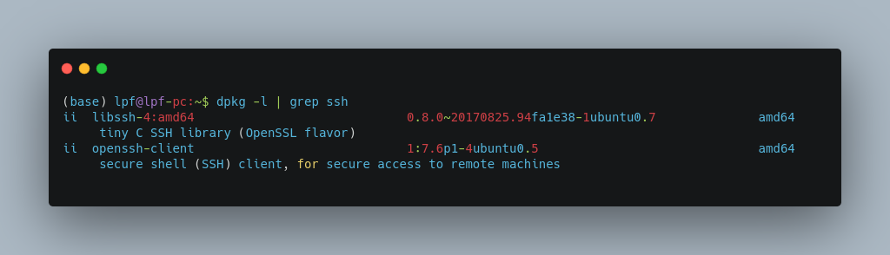
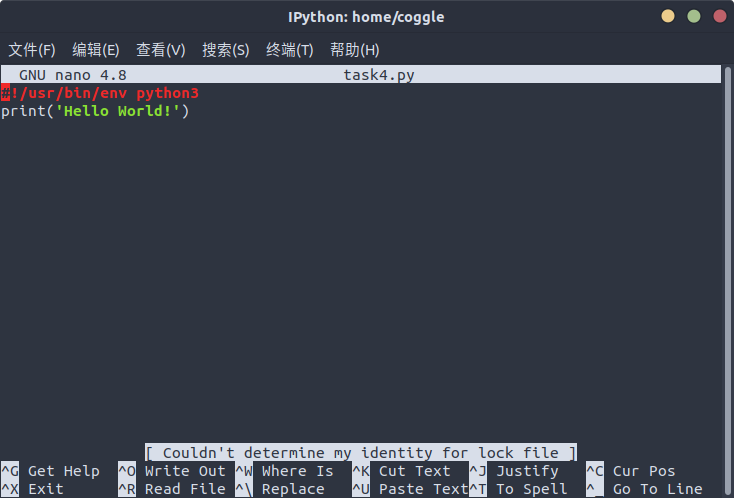
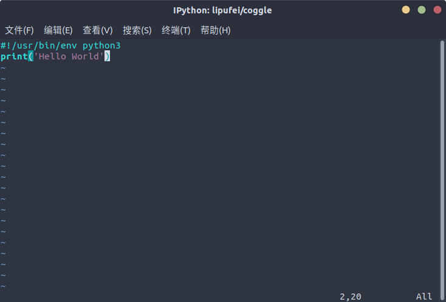

# Coggle 30 Days of ML（21年11月）Linux基础使用

学习视频：[视频1](https://bilibili.com/video/BV1yr4y1C7RC)、[视频2](https://bilibili.com/video/BV1Zr4y1F7sQ)、[视频3](https://bilibili.com/video/BV1S64y1v7UG)

## 1. Task1:使用命令行登录指定的Linux环境

本机系统为Ubuntu 18.04.6 LTS，任务要点：ssh登录、密码输入、环境配置。

a. SSH分客户端openssh-client和服务端openssh-server，我们使用的是客户端，ubuntu有默认安装，如果没有则sudo apt-get install openssh-client，查看当前安装的ssh状态，输入`dpkg -l | grep ssh`即可



b. Ubuntu系统ssh登录很简单，在终端输入`ssh username@IP`即可，其中username为远程服务器的用户名，IP为服务器端的IP地址，回车后会提示输入密码。出现以下信息则登录成功。


## 2. Task2:在目录下创建文件夹、删除文件夹

学习链接：[Linux系统目录结构](https://www.runoob.com/linux/linux-system-contents.html)、[Linux文件与目录管理](https://www.runoob.com/linux/linux-file-content-manage.html)

任务要点：创建文件夹、创建文件、删除文件、删除文件夹

a. 在/home/coggle目录下，新建一个以你英文昵称（中间不要有空格哦）的文件夹A

通过ssh登录指定的Linux环境后，查看当前路径，`pwd`（英文全拼：print work directory）：显示目前的目录

```shell
# 显示目前的目录
[coggle@i-7lo31rsr ~]$ pwd
/home/coggle
```

b. 完成下面的任务

```shell
# 1. 在/home/coggle目录下，新建一个以你英文昵称（中间不要有空格哦）的文件夹A
[coggle@i-7lo31rsr ~]$ mkdir lipufei
# 查看当前路径下文件，可以看到新建的名为lipufei的文件夹
[coggle@i-7lo31rsr ~]$ ls
Amihua        codetosky   isstte    lucas           wangzhenhua
Amy           coggle      jack      lws             wfxu
Janayt        coogle      jane      monkeytrainer   wsz
Lecarry       cooltxeel   jims      mrleo           xzw
LitraLin      dengchunyu  kongbai   nagaloop        yinningchuan
LonelVino     dongyu      kuan      pixeldog        yiuwai
Sunny         epoch       lance     rren            yunuotianbian
TCSC          ftl         leigang   rrencoggle      zifei
Yuanzhenshui  future_y    leo       runoob          zkniu
abc           guoheng     lf        sampras
bianbian      hello.py    linestao  selnim_text.py
brain         hgw         lipufei   t
bunny         im          lu        turkeymz
# 2. 在文件夹A内部创建一个以coggle命名的文件夹B
[coggle@i-7lo31rsr ~]$ cd lipufei/
[coggle@i-7lo31rsr lipufei]$ mkdir coggle
[coggle@i-7lo31rsr lipufei]$ ls
coggle
[coggle@i-7lo31rsr lipufei]$ cd coggle/
# 3. 在B文件夹内创建一个空txt文件
[coggle@i-7lo31rsr coggle]$ touch empty.txt
[coggle@i-7lo31rsr coggle]$ ls
empty.txt
# 4. 删除步骤4创建的文件
[coggle@i-7lo31rsr coggle]$ rm empty.txt 
[coggle@i-7lo31rsr coggle]$ ls
[coggle@i-7lo31rsr coggle]$ pwd
/home/coggle/lipufei/coggle
# 5. 删除文件夹B，然后删除文件夹A
[coggle@i-7lo31rsr coggle]$ cd ..
[coggle@i-7lo31rsr lipufei]$ rmdir coggle/
[coggle@i-7lo31rsr lipufei]$ ls
[coggle@i-7lo31rsr lipufei]$ cd ..
[coggle@i-7lo31rsr ~]$ rmdir lipufei/
[coggle@i-7lo31rsr ~]$ ls
Amihua        codetosky   isstte    lws             turkeymz
Amy           coggle      jack      monkeytrainer   wangzhenhua
Janayt        coogle      jane      mrleo           wfxu
Lecarry       cooltxeel   jims      nagaloop        wsz
LitraLin      dengchunyu  kongbai   pixeldog        xzw
LonelVino     dongyu      kuan      rren            yinningchuan
Sunny         epoch       lance     rrencoggle      yiuwai
TCSC          ftl         leigang   runoob          yunuotianbian
Yuanzhenshui  future_y    leo       sampras         zifei
abc           guoheng     lf        selnim_text.py  zkniu
bianbian      hello.py    linestao  t
brain         hgw         lu        test666
bunny         im          lucas     test789
```

## 3. Task3:在目录下下载文件、阅读文件

学习链接：[wget教程](https://www.cnblogs.com/pretty-ru/p/10936023.html)、[阅读文件基础教程](https://www.cnblogs.com/jixp/p/10833801.html)、[阅读文件基础教程2](https://www.runoob.com/linux/linux-file-content-manage.html)

任务要点：下载文件、移动文件、阅读文件

```shell
# 1. 在home/coggle目录下，新建一个以你英文昵称（中间不要有空格哦）的文件夹A
# 在文件夹A内部创建一个以coggle命令的文件夹B
# mkdir -p 递归创建文件夹
[coggle@i-7lo31rsr ~]$ mkdir -p lipufei/coggle
[coggle@i-7lo31rsr ~]$ cd lipufei/coggle/
[coggle@i-7lo31rsr coggle]$ pwd
/home/coggle/lipufei/coggle
# 2. 使用wget命令下载https://mirror.coggle.club/dataset/affairs.txt，到文件夹B
[coggle@i-7lo31rsr coggle]$ wget https://mirror.coggle.club/dataset/affairs.txt
--2021-11-09 10:53:57--  https://mirror.coggle.club/dataset/affairs.txt
Resolving mirror.coggle.club (mirror.coggle.club)... 139.215.234.228, 2408:8731:c001:2:3::3fc
Connecting to mirror.coggle.club (mirror.coggle.club)|139.215.234.228|:443... connected.
HTTP request sent, awaiting response... 200 OK
Length: 92161 (90K) [text/plain]
Saving to: ‘affairs.txt’

affairs.txt         100%[===================>]  90.00K  --.-KB/s    in 0.06s   

2021-11-09 10:53:57 (1.50 MB/s) - ‘affairs.txt’ saved [92161/92161]

[coggle@i-7lo31rsr coggle]$ ls
affairs.txt
# 3. 使用head、cat、tail命令阅读下载的文件。
# head [-n number] 文件  取出文件前面几行
[coggle@i-7lo31rsr coggle]$ head -n 5 affairs.txt 
rate_marriage,age,yrs_married,children,religious,affairs
5,32,6,1,3,0
4,22,2.5,0,2,0
3,32,9,3,3,1
3,27,13,3,1,1
# tail [-n number] 文件  取出文件后面几行
[coggle@i-7lo31rsr coggle]$ tail -n 5 affairs.txt 
4,22,2.5,0,3,0
5,22,2.5,0,2,0
5,32,13,2,3,0
4,32,13,1,1,0
# cat [-AbEnTv] 由第一行开始显示文件内容 -E:将结尾的断行字节 $ 显示出来；
[coggle@i-7lo31rsr coggle]$ cat -E affairs.txt
4,22,0.5,0,2,0$
5,42,23,2,4,0$
5,22,2.5,2,2,0$
5,42,23,4,4,0$
4,27,6,0,3,0$
5,32,13,3,3,0$
5,32,13,4,2,0$
3,27,6,2,4,0$
4,22,2.5,0,3,0$
5,22,2.5,0,2,0$
5,32,13,2,3,0$
4,32,13,1,1,0$
5,22,2.5,0,2,0[coggle@i-7lo31rsr coggle]$ 
# 4. 在命令行使用ipython进入python3环境，并使用pandas读取下载的文件。
[coggle@i-7lo31rsr coggle]$ ipython
Python 3.8.10 (default, Sep 28 2021, 16:10:42) 
Type 'copyright', 'credits' or 'license' for more information
IPython 7.29.0 -- An enhanced Interactive Python. Type '?' for help.

In [1]: import pandas as pd

In [2]: df = pd.read_csv("./affairs.txt")

In [3]: print(df)
      rate_marriage   age  yrs_married  children  religious  affairs
0                 5  32.0          6.0       1.0          3        0
1                 4  22.0          2.5       0.0          2        0
2                 3  32.0          9.0       3.0          3        1
3                 3  27.0         13.0       3.0          1        1
4                 4  22.0          2.5       0.0          1        1
...             ...   ...          ...       ...        ...      ...
6361              4  22.0          2.5       0.0          3        0
6362              5  22.0          2.5       0.0          2        0
6363              5  32.0         13.0       2.0          3        0
6364              4  32.0         13.0       1.0          1        0
6365              5  22.0          2.5       0.0          2        0

[6366 rows x 6 columns]

In [4]: print(df.shape)
(6366, 6)

In [5]: exit
[coggle@i-7lo31rsr coggle]$ 
```

## 4. Task4:在目录下使用vi或vim编辑文件

学习链接：[Nano的使用](https://blog.csdn.net/junxieshiguan/article/details/84104912)、[vim的使用1](https://www.runoob.com/linux/linux-vim.html)、[vim的简单使用](./vim的使用.md)

分别使用Nano和Vim创建py文件，并输入以下内容，并运行

```python
#!/usr/bin/env python3
print('Hello World!')
```

```shell
# 1. 使用nano创建py文件并执行
[coggle@i-7lo31rsr coggle]$ nano task4.py
```



```shell
[coggle@i-7lo31rsr coggle]$ ipython
Python 3.8.10 (default, Sep 28 2021, 16:10:42) 
Type 'copyright', 'credits' or 'license' for more information
IPython 7.29.0 -- An enhanced Interactive Python. Type '?' for help.

In [1]: %run task4.py
Hello World!

In [2]: exit()
```

```shell
# 2. 使用vim创建py文件并执行
[coggle@i-7lo31rsr coggle]$ ls
affairs.txt  task4.py
[coggle@i-7lo31rsr coggle]$ rm task4.py 
[coggle@i-7lo31rsr coggle]$ ls
affairs.txt
[coggle@i-7lo31rsr coggle]$ vim task4.py
[coggle@i-7lo31rsr coggle]$ ipython
Python 3.8.10 (default, Sep 28 2021, 16:10:42) 
Type 'copyright', 'credits' or 'license' for more information
IPython 7.29.0 -- An enhanced Interactive Python. Type '?' for help.

In [1]: %run task4.py
Hello World

In [2]: exit()
```

vim界面截图如下：



## 5. Task5:在目录下创建py文件，并进行运行

任务要点：python的os和sys系统接口，文件接口

学习资料：[学习python下os模块处理文件和目录的函数](https://www.runoob.com/python/os-file-methods.html)、[学习python下sys模块和传参函数](https://www.runoob.com/python3/python3-module.html)

要求：在home/coggle目录下，在你英文昵称（中间不要有空格哦）的文件夹中，新建一个test5.py文件，改程序可以使用os、sys模块完成以下功能：

```python
#!/usr/bin/python3

import os
import sys
功能1：打印命令行参数
print('命令行参数如下：')
for i in sys.argv:
    print(i)
功能2：使用os模块打印/usr/bin/路径下所有以m开头的文件。
print("\n/usr/bin/目录下m开头的文件名为：")
path = "/usr/bin/"
for file in os.listdir(path):
    if file[0] == 'm':
        print(file)
```

## 6. Task6:在目录下创建py目录，并进行import导入

任务要点：python代码模块化

学习资料：[学习python模块化](https://www.runoob.com/python3/python3-module.html)

要求：编写test6.py和affairs.py完成以下功能：

- 功能1：affairs.py代码完成https://mirror.coggle.club/dataset/affairs.txt文件的读取，这里可以直接pd.read_csv('https://mirror.coggle.club/dataset/affairs.txt')来完成。这一部分建议写为函数。

- 功能2：test6.py可以导入affairs.py代码

- 功能3：test6.py可以进行命令行解析，输出[affairs.txt](https://mirror.coggle.club/dataset/affairs.txt)具体的第几行内容。

其中affairs.py代码内容为：

```python
#!/usr/bin/env python3
import os
import pandas as pd

def read_affair(rows):
    df = pd.read_csv("https://mirror.coggle.club/dataset/affairs.txt")
    print("第%d行的内容是："%(rows))
    print(df.iloc[rows-1])
    return df.iloc[rows-1]
if __name__ == '__main__':
    read_affair(10)
```

test6.py代码内容为：

```python
#!/usr/bin/env python
import sys
from affairs.affairs import read_affair

for i in sys.argv[1:]:
    try:
        read_affair(int(i))
    except:
        print("参数不正确！")
```

在/home/coggle/lipfuei/目录下，执行`python3 test6.py 10`：

```shell
[coggle@i-7lo31rsr lipufei]$ python3 test6.py 10
第10行的内容是：
rate_marriage     5.0
age              37.0
yrs_married      23.0
children          5.5
religious         2.0
affairs           1.0
```

## 7. Task7:在Linux系统中后台运行应用程序，并打印日志

任务要点：程序后台运行，进程管理

- [ ] 步骤1：在/home/coggle目录下在你英文昵称（中间不要有空格哦）的文件夹中创建一个sleep.py文件，该文件需要完成以下功能：

  - 程序一直运行

  - 每10秒输出当前时间

- [ ] 步骤2：学习 [&](https://blog.csdn.net/a736933735/article/details/89577557) 和 [nohup](http://ipcmen.com/jobs)后台执行的方法,[链接2](https://blog.csdn.net/davidhzq/article/details/102766881)

- [ ] 步骤3：学习[tmux](https://zhuanlan.zhihu.com/p/98384704)的[使用](https://www.ruanyifeng.com/blog/2019/10/tmux.html)，将步骤1的程序进行后台运行，并将输出结果写入到txt文件。

查看**PID**的详细信息，[Linux](http://lib.csdn.net/base/linux)在启动一个进程时，系统会在/proc下创建一个以PID命名的文件夹，在该文件夹下会有我们的进程的信息，其中包括一个名为exe的文件即记录了绝对路径，通过ll或ls –l命令即可查看。即`ll /proc/PID`，cwd符号链接的是进程运行目录；exe符号连接就是执行程序的绝对路径；cmdline就是程序运行时输入的命令行命令；environ记录了进程运行时的环境变量；fd目录下是进程打开或使用的文件的符号连接。

`pgrep -l name`查看[指定进程](https://blog.csdn.net/qq_32534441/article/details/102787381)的PID，如`pgrep -l python`

`fg+任务标识符`：将任务调到前台

TMUX的最简单操作流程

> 1. 新建会话`tmux new -s my_session`。
> 2. 在 Tmux 窗口运行所需的程序。
> 3. 按下快捷键`Ctrl+b d`将会话分离。
> 4. 下次使用时，重新连接到会话`tmux attach-session -t my_session`。

sleep.py文件内容为：

  ```python
  #!/usr/bin/env python3
  import time
  
  while(1):
      now_time = str(time.ctime())
      print(now_time)
      time.sleep(10)
  ```

```shell
# 启动tmux
$ tmux
# 将脚本挂在后台
$ nohup python3 sleep.py >logs.txt &
[1] 1279264
$ nohup: ignoring input and redirecting stderr to stdout
# 分离会话，回到真窗口
$ tmux detach

$ tmux
[detached (from session 0)]
# 查看当前会话
$ tmux ls
0: 1 windows (created Sun Nov 14 22:54:17 2021)

# 重接会话 使用伪窗口编号
$ tmux attach -t 0
# 查看任务列表及任务状态，包括后台运行的任务
$ jobs -l
[1]+ 1279264 Running                 nohup python3 sleep.py > logs.txt &
# 将任务调到前台，终止任务
$ fg 1
nohup python3 sleep.py > logs.txt
^C
$ ls
logs.txt  sleep.py
# 查看重定向到txt文件的内容，是刚才运行的时间
$ cat logs.txt 
Sun Nov 14 22:54:45 2021
Sun Nov 14 22:54:55 2021
Sun Nov 14 22:55:05 2021
Sun Nov 14 22:55:15 2021
Sun Nov 14 22:55:25 2021
Sun Nov 14 22:55:35 2021
Sun Nov 14 22:55:45 2021
Sun Nov 14 22:55:55 2021
Sun Nov 14 22:56:05 2021
Sun Nov 14 22:56:15 2021
Sun Nov 14 22:56:25 2021
Sun Nov 14 22:56:35 2021
Traceback (most recent call last):
  File "sleep.py", line 7, in <module>
    time.sleep(10)
KeyboardInterrupt

```

## 8. Task8:使用grep和awk从文件中筛选字符串

任务要点：字符筛选

- 步骤1：下载周杰伦歌词文本，并进行解压。https://mirror.coggle.club/dataset/jaychou_lyrics.txt.zip

- 步骤2：利用grep命令完成以下操作，并输出到屏幕;[链接1](https://blog.csdn.net/baidu_41388533/article/details/107610827)、[链接2](https://www.runoob.com/linux/linux-comm-grep.html)

  - 统计歌词中 包含【超人】的歌词

  - 统计歌词中 包含【外婆】但不包含【期待】的歌词

  - 统计歌词中 以【我】开头的歌词

  - 统计歌词中 以【我】结尾的歌词

- 步骤3：利用sed命令完成以下操作，并输出到屏幕；[链接1](https://www.cnblogs.com/JohnLiang/p/6202962.html)

  - 将歌词中 第2行 至 第40行 删除

  - 将歌词中 所有【我】替换成【你】

```shell
# 下载周杰伦歌词文本
$ wget https://mirror.coggle.club/dataset/jaychou_lyrics.txt.zip
--2021-11-15 14:28:25--  https://mirror.coggle.club/dataset/jaychou_lyrics.txt.zip
Resolving mirror.coggle.club (mirror.coggle.club)... 113.229.252.249, 2408:872b:f01:1002:3::3fc
Connecting to mirror.coggle.club (mirror.coggle.club)|113.229.252.249|:443... connected.
HTTP request sent, awaiting response... 200 OK
Length: 52607 (51K) [application/zip]
Saving to: ‘jaychou_lyrics.txt.zip’

jaychou_lyrics.txt.zip            100%[=============================================================>]  51.37K  --.-KB/s    in 0.02s   

2021-11-15 14:28:26 (2.02 MB/s) - ‘jaychou_lyrics.txt.zip’ saved [52607/52607]
# 进行解压
$ unzip jaychou_lyrics.txt.zip 
Archive:  jaychou_lyrics.txt.zip
  inflating: jaychou_lyrics.txt      
$ ls
jaychou_lyrics.txt  jaychou_lyrics.txt.zip
# 统计歌词中 包含【超人】的歌词
$ grep -c "超人" jaychou_lyrics.txt
5
$ grep -n "超人" jaychou_lyrics.txt
5795:如果超人会飞 那就让我在空中停一停歇
5798:不要问我哭过了没 因為超人不能流眼泪
5815:只能说当超人真的好难
5816:如果超人会飞 那就让我在空中停一停歇
5819:不要问我哭过了没 因為超人不能流眼泪
# 统计歌词中 包含【外婆】但不包含【期待】的歌词
$ cat jaychou_lyrics.txt|grep -v "期待"|grep -c "外婆"
14
# 统计歌词中 以【我】开头的歌词
$ grep -c "^我" jaychou_lyrics.txt
768
# 统计歌词中 以【我】结尾的歌词
$ grep -c "我$" jaychou_lyrics.txt
118
# 将歌词中 第2行 至 第40行 删除
$ sed '2,40d' jaychou_lyrics.txt
# 将歌词中 所有【我】替换成【你】
$ sed 's/我/你/g' jaychou_lyrics.txt

```

## 9. Task9:在目录下创建zip和tar压缩文件，并进行解压

任务要点：[文件压缩](https://www.cnblogs.com/wxlf/p/8117602.html)

- 步骤1：在/home/coggle目录下在你英文昵称（中间不要有空格哦）的文件夹中，下载https://mirror.coggle.club/dataset/jaychou_lyrics.txt.zip

- 步骤2：使用zip 压缩/home/coggle目录下在你英文昵称（中间不要有空格哦）的文件夹

- 步骤3：将 /home/coggle目录下在你英文昵称（中间不要有空格哦）的文件夹，打包为tar格式。

- 步骤4：将 /home/coggle目录下在你英文昵称（中间不要有空格哦）的文件夹，打包为tar.gz格式。

```shell
$ pwd
/home/coggle
$ cd lipufei/
$ ls
jaychou_lyrics.txt	logs.txt   sleep.py
jaychou_lyrics.txt.zip	nohup.out  task8
# 使用zip 压缩
$ zip lipufei.zip ./*
  adding: jaychou_lyrics.txt (deflated 69%)
  adding: jaychou_lyrics.txt.zip (stored 0%)
  adding: logs.txt (deflated 61%)
  adding: nohup.out (deflated 53%)
  adding: sleep.py (deflated 19%)
  adding: task8/ (stored 0%)
$ ls
jaychou_lyrics.txt	lipufei.zip  nohup.out	task8
jaychou_lyrics.txt.zip	logs.txt     sleep.py
$ tar czvf lipufei.tar ./*		# 打包为tar格式
./jaychou_lyrics.txt
./jaychou_lyrics.txt.zip
./lipufei.zip
./logs.txt
./nohup.out
./sleep.py
./task8/
./task8/jaychou_lyrics.txt.zip
./task8/jaychou_lyrics.txt
./task8/temp.txt
$ ls
jaychou_lyrics.txt	lipufei.tar  logs.txt	sleep.py
jaychou_lyrics.txt.zip	lipufei.zip  nohup.out	task8
$ tar czvf lipufei.tar.gz  ./*	# 打包为tar.gz格式
./jaychou_lyrics.txt
./jaychou_lyrics.txt.zip
./lipufei.tar
./lipufei.zip
./logs.txt
./nohup.out
./sleep.py
./task8/
./task8/jaychou_lyrics.txt.zip
./task8/jaychou_lyrics.txt
./task8/temp.txt
$ ls
jaychou_lyrics.txt	lipufei.tar	lipufei.zip  nohup.out	task8
jaychou_lyrics.txt.zip	lipufei.tar.gz	logs.txt     sleep.py
```

## 10. Task10:使用find和locate定位文件

任务要点：文件搜索

学习资料：[参考1](https://www.runoob.com/linux/linux-comm-find.html)、[参考2](https://www.cnblogs.com/linjiqin/p/11678012.html)、[参考3](https://www.runoob.com/linux/linux-comm-locate.html)

- 步骤1：使用find统计文件系统中以py为后缀名的文件个数

- 步骤2：使用find寻找/home/文件夹下文件内容包含coggle的文件

- 步骤3：使用locate寻找到python3.preinst文件

```shell
$ cd /
$ pwd
/
$ find . -name "*.py"|wc -l		# 使用find统计文件系统中以py为后缀名的文件个数
find: ‘./snap/core18/2246/var/cache/ldconfig’: Permission denied
find: ‘./snap/core18/2246/var/lib/private’: Permission denied
find: ‘./snap/core18/1885/etc/ssl/private’: Permission denied
find: ‘./snap/core18/1885/root’: Permission denied
find: ‘./snap/core18/1885/var/cache/ldconfig’: Permission denied
find: ‘./snap/core18/1885/var/lib/private’: Permission denied
find: ‘./snap/core18/1885/var/lib/snapd/void’: Permission denied
find: ‘./tmp/snap.lxd’: Permission denied
find: ‘./tmp/systemd-private-3d33cdcd302144a4a28246fc85cf9711-systemd-resolved.service-xUMvug’: Permission denied
find: ‘./tmp/systemd-private-3d33cdcd302144a4a28246fc85cf9711-systemd-logind.service-AOegJf’: Permission denied
find: ‘./tmp/systemd-private-3d33cdcd302144a4a28246fc85cf9711-systemd-timesyncd.service-TpsCBi’: Permission denied
11364
# 使用find寻找/home/文件夹下文件内容包含coggle的文件
$  grep -r "coggle" /home/	
$ find /home/ -type f | xargs grep "coggle"
# 用locate寻找到python3.preinst文件
$ locate python3.preinst
/var/lib/dpkg/info/python3.preinst
```

